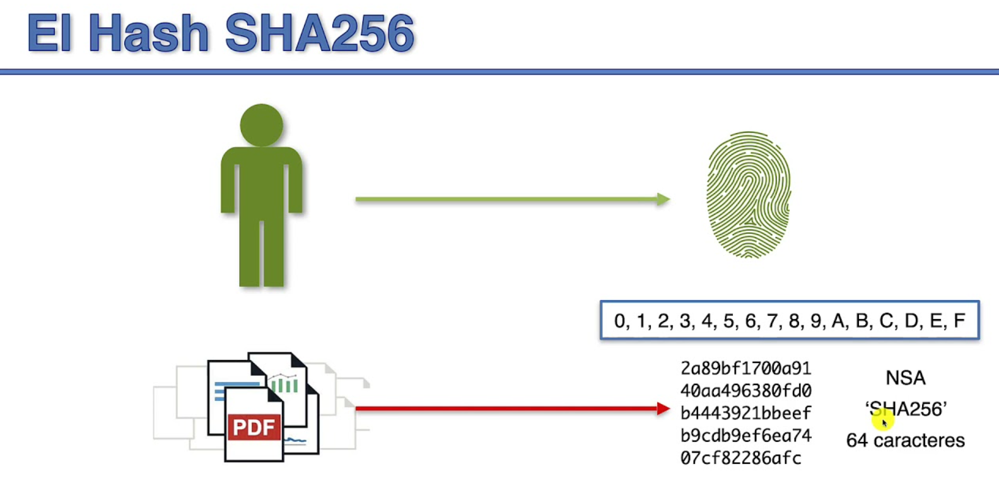
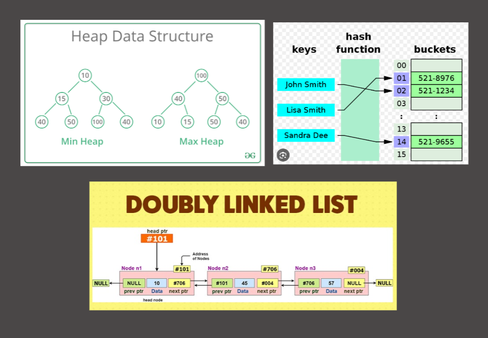
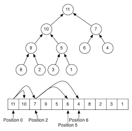
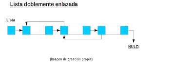
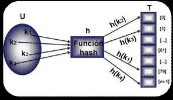

<h1 align="center">BlockChain05</h1>

## Integrantes
* Integrante1: Tovar Tolentino, Mariel
* Integrante2: Isidro Salazar, Leonardo
* Integrante3: Huarino Anchillo, Noemi
* Integrante4: Sandoval Huamani, Adrian
* Integrante5: Chavarria Humareda, Omar

<a name="readme-top"></a>
<details open>
  <summary><h3>Tabla de contenidos:<h3></summary>
  <ul>
    <li><a href="#acerca-del-proyecto">
      Acerca del proyecto
      <ul>
        <li><a href="#introducción">Introducción</a></li>
        <li><a href="#descripción">Descripción</a></li>
        <li><a href="#importancia-del-blockchain">Importancia del Blockchain</a></li>
      </ul>
    </a></li>
    <li><a href="#funcionalidad-de-la-aplicación">
      Funcionalidad de la aplicación
      <ul>
        <li><a href="#estructuras-de-datos">Estructuras de datos</a></li>
        <li><a href="#proof-of-work">Proof of work</a></li>
        <li><a href="#análisis-algorítmico">Análisis algorítmico</a></li>
        <li><a href="#interfaz-gráfica">Interfaz gráfica</a></li>
      </ul>
    </a></li>
    <li><a href="#referencias-bibliográficas">Referencias bibliográficas</a></li>
    <li><a href="#anexos">
      Anexos
    <ul>
        <li><a href="#participación-grupal">Participación grupal</a></li>
      </ul>
    </a></li>
  </ul>
</details>

<hr>

## Acerca del proyecto

### Introducción

#### ¿Qué es BlockChain?

Es una cadena de bloques descentralizada de registro de datos que utiliza una red de nodos para almacenar y validar transacciones de forma transparente y segura, lo que permite la creación de registros inmutables y confiables.


#### ¿Qué es SHA-256? (Secure Hash Algorithm 256-bit)

Es un algoritmo de hash criptográfico ampliamente utilizado que produce una huella digital de 256 bits(32 bytes) única para cualquier dato dado, lo que garantiza la integridad y seguridad de la información. Ofrece un mayor nivel de seguridad que MD5 y SHA-1 (versiones anteriores) y se considera seguro para su uso en la mayoría de los casos.

<div align="center">
    
</div><br>

### Descripción
El dominio transaccional que hemos escogido es : Retiros de dinero (cliente, lugar, monto, fecha). 

### Importancia del Blockchain
 
La importancia de blockchain radica en su capacidad para proporcionar seguridad en las transacciones a través de su registro distribuido en bloques. Cada bloque está enlazado con el bloque anterior mediante una función criptográfica, lo que garantiza la integridad de la cadena. Esto significa que, en caso de un intento de modificación o ataque, todos los bloques posteriores se vuelven inaccesibles o inválidos, lo que proporciona una mayor protección contra la manipulación de datos.

<hr>

## Funcionalidad de la aplicación

### Estructuras de datos utilizadas

<div align="center">
    
</div><br>

- ### Heap

<div align="center">
    
</div><br>

1. *Priorización de transacciones*: Si deseas procesar las transacciones de retiro de dinero en un orden específico, puedes utilizar un heap para mantener un orden de prioridad. Por ejemplo, si tienes transacciones urgentes que requieren un procesamiento rápido, puedes asignarles una mayor prioridad y colocarlas en la parte superior del heap. De esta manera, puedes garantizar que las transacciones más importantes se procesen primero.

2. *Gestión de límites de retiro*: Si tienes límites de retiro establecidos para cada cliente, un heap puede ayudarte a garantizar que se cumplan esos límites. Puedes mantener un heap de transacciones pendientes, ordenadas por la cantidad de dinero a retirar. Al procesar cada transacción, verificas si el retiro excede el límite establecido para ese cliente. Si es así, puedes rechazar la transacción o tomar alguna otra acción según tus requisitos.
La hemos implementado para usar el maxHeap para el máximo valor y el minHeap para el mínimo valor de los datos ingresados.

- ### DoubleList (Lista doblemente enlazada)

<div align="center">
    
</div><br>

El uso de una lista doblemente enlazada (DoubleList) puede ser útil en varias partes de la implementación.

Escenarios donde se puede utilizar **doublelist**:

1. *Mantenimiento del historial de transacciones*: Utilizar una lista doblemente enlazada para mantener un historial ordenado cronológicamente de las transacciones registradas en la aplicación. Cada nodo de la lista contendría los detalles de una transacción, y los enlaces entre los nodos permitirían un recorrido eficiente tanto hacia adelante como hacia atrás en el historial. Esto sería útil para mostrar el historial de transacciones a los usuarios, realizar búsquedas en el historial o para fines de auditoría.


2. *Almacenamiento ordenado de transacciones*: Puedes utilizar la lista doblemente enlazada para almacenar y mantener un registro ordenado de las transacciones de retiro de dinero. Cada nodo de la lista podría representar una transacción y contener la información relevante, como el cliente, el lugar, el monto y la fecha. La lista te permitirá agregar nuevas transacciones de manera eficiente, mantenerlas ordenadas según la fecha y acceder a ellas fácilmente para consultas o análisis.

3. *Operaciones de inserción y eliminación eficientes*: La lista doblemente enlazada es eficiente para realizar operaciones de inserción y eliminación en cualquier posición de la lista. Por ejemplo, si necesitas insertar una nueva transacción en una posición específica según la fecha, puedes aprovechar los punteros previos y siguientes de los nodos para realizar la inserción de manera eficiente. Del mismo modo, si deseas eliminar una transacción de la lista, los punteros te permitirán actualizar las referencias correctamente sin afectar el resto de la lista.

4. *Recorrido bidireccional de la lista*: Al ser una lista doblemente enlazada, puedes recorrerla tanto hacia adelante como hacia atrás. Esto puede ser útil si necesitas realizar operaciones de búsqueda o análisis en las transacciones en función de diferentes criterios, como buscar transacciones de un cliente específico o realizar un análisis histórico de los retiros.  

- ### Hash

<div align="center">
    
</div><br>

1. *Almacenamiento eficiente de transacciones*: Puedes utilizar una tabla hash para almacenar las transacciones de retiro de dinero. Cada transacción puede tener un identificador único, como el número de transacción, y la tabla hash puede usar ese identificador como clave para acceder rápidamente a la transacción correspondiente. Esto te permitirá almacenar y recuperar las transacciones de forma eficiente sin tener que recorrer una lista o una estructura más compleja.

2. *Búsqueda rápida de transacciones*: Si necesitas buscar transacciones de retiro de dinero según criterios específicos, como el número de cliente o la fecha, una tabla hash puede ser muy útil. Puedes utilizar diferentes campos de la transacción como claves en la tabla hash y realizar búsquedas rápidas basadas en esos campos. Por ejemplo, si quieres encontrar todas las transacciones de un cliente en particular, simplemente buscarías en la tabla hash utilizando el identificador del cliente como clave.

3. *Detección de transacciones duplicadas*: La tabla hash puede ayudarte a evitar la inserción de transacciones duplicadas de retiro de dinero. Puedes utilizar la función de hash para generar una clave única para cada transacción y verificar si ya existe una transacción con la misma clave en la tabla hash. Esto te permitirá evitar la duplicación de transacciones y mantener la integridad de los datos.

<hr>

### Proof of Work

Es un algoritmo de consenso permite verificar si quien contribuye al blockchain lo hace de forma legítima o está incurriendo en fraude. Permite la verificación, evitar ataques mediante el 51% y cualquier mecanismo que permita mantener al correcto crecimiento del blockchain.

El proof of work que implementamos es una verificación en la cual el número de ceros al principio de la clave hash es igual a 4, y mientras esta condición no se cumpla va a seguir generando claves hash.

<hr>

### Análisis algorítmico

Estas son los métodos implementados actualmente en el BlockChain:

- `BlockChain::searchUser(const string& username, const string& password)` 

Esta función valida si existe el bloque correspondiente al usuario y su contraseña (previamente verificada). En ella se busca solo por el DoubleList, complejidad **$\mathcal{O}(n)$**(proximamente se reducirá a **$\mathcal{O}(log \ n)$** a través de un árbol BST o Btree)

 - `BlockChain::insertTransaction()`:

Esta función inserta una nueva transacción en el Blockchain. En ella se insertan internamente en las estructuras Heap **$\mathcal{O}(log \ n)$** y DoubleList **$\mathcal{O}(1)$**.

- `BlockChain::createUser(const string &username, const string &password, float amount, const string &date)`

Esta función crea un nuevo bloque que pertenecerá al usuario. Internamente realiza un push del nuevo bloque en el DoubleList **$\mathcal{O}(1)$** y en el HasTable **$\mathcal{O}(1)$**.


- `BlockChain::MaxDate(const std::string &username, const std::string &password)`

Obtiene la transacción con la fecha más reciente de un usuario específico en el blockchain. Se obtiene por el `top` del Max-Heap de transacciones por fecha **$\mathcal{O}(1)$**

- `BlockChain::MinDate(const std::string &username, const std::string &password)`

Obtiene la transacción con la fecha más antigua de un usuario específico en el blockchain. Se obtiene por el `top` del Min-Heap de transacciones por fecha **$\mathcal{O}(1)$**

- `BlockChain::MaxAmount(const std::string &username, const std::string &password)`

Obtiene la transacción con el monto más alto de un usuario específico en el blockchain. Se obtiene por el `top` del Max-Heap de transacciones por monto **$\mathcal{O}(1)$**

- `BlockChain::MinAmount(const std::string &username, const std::string &password)`

Obtiene la transacción con el monto más bajo de un usuario específico en el blockchain.Se obtiene por el `top` del Min-Heap de transacciones por monto **$\mathcal{O}(1)$**

- `BlockChain::downloadFile(const std::string& path)`

Descarga las transacciones del blockchain en un archivo de texto en la ubicación especificada. En ella recorre todos los bloques existentes en el BlockChain y muestra la información de cada uno. **$\mathcal{O}(n)$**

<hr>

### Interfaz gráfica

- Se está trabajando con SFML.
- Interfaz gráfica en proceso


<hr>

## Ambiente de la aplicación

### Requerimientos

- Compilador g++ de [MinGW-w64](https://www.mingw-w64.org/downloads/).
- Bibioteca [SFML](https://www.sfml-dev.org/download/sfml/2.5.1/) desde la versión 2.4 o 2.5.
- [Make](https://gnuwin32.sourceforge.net/packages/make.htm) para Windows.
 
### ¿Cómo se ejecuta?

1. Agregar el directorio `C:\SFML-2.5.x` en las variables del sistema.
2. Agregar el directorio `C:\Program Files (x86)\GnuWin32\bin` en las variables del sistema. 
3. Inicia la aplicación con el archivo: 

```bash
./start.bat
```


<hr>

## Conclusiones

- El blockchain nos ha ayudado a poder proteger mejor nuestra estructura de datos y de esa manera darle confianza a nuestro cliente para con la integridad de sus datos y demás. 
- Las estructuras de datos como **heap, chain hash y double list** son fundamentales en **blockchain** debido a su importancia en la eficiencia y seguridad del sistema. El heap permite una gestión eficiente de las transacciones y bloques, asegurando un ordenamiento óptimo. El chain hash proporciona una forma rápida de acceder a los bloques anteriores y verificar la integridad de la cadena. El double list permite un acceso rápido y eficiente a los datos, facilitando la validación y el seguimiento de transacciones en la cadena de bloques. En resumen, estas estructuras de datos mejoran la velocidad, la seguridad y la escalabilidad del sistema blockchain.

<hr>

## Referencias bibliográficas

[OpenSSL](https://www.openssl.org/)

[BlockChain Demo](https://andersbrownworth.com/blockchain/)

[Generación de datos ficticios](https://generatedata.com/)

**Para el Proof of work se investigó en las siguiente páginas web:**

https://academy.bit2me.com/que-es-proof-of-work-pow/

https://www.iebschool.com/blog/proof-of-work-blockchain-tecnologia/

https://www.profesionalreview.com/2021/07/31/que-es-proof-of-work/

Moreno, M. V. (2022). Blockchain y algoritmo de consenso Proof of Work. *MoleQla: revista de Ciencias de la Universidad Pablo de Olavide, (46), 14.* https://dialnet.unirioja.es/servlet/articulo?codigo=8651237
    
<hr>

## Anexos

### Participación grupal

| Integrantes | Código | Actividad Concluida | Porcentaje de participación |
|----------|----------|----------|----------|
| MARIEL TOVAR TOLENTINO    | 202120575   | Parte del README.md + Generación e implementación de Datos + funciones del blockchain.h   | 100% |
| LEONARDO ISIDRO SALAZAR   | 202120297   | Parte del README.md + Investigación sobre Proof of work + funciones del blockchain.h   | 100% |
| NOEMI HUARINO ANCHILLO    | 202120284   | Parte del README.md + Investigación sobre SHA-256 + funciones del blockchain.h   | 100% |
| OMAR CHAVARRIA HUMAREDA    | 202120631   | Parte del README.md + Carpeta: structures + funciones del block.h   | 100% |
| ADRIAN SANDOVAL HUAMANI    | 202120522   | Parte del README.md + Investigación sobre la Interfaz + funciones del block.h   | 100% |

* **transaction.h** y demás fué concluida por todos los integrantes.


<hr>
